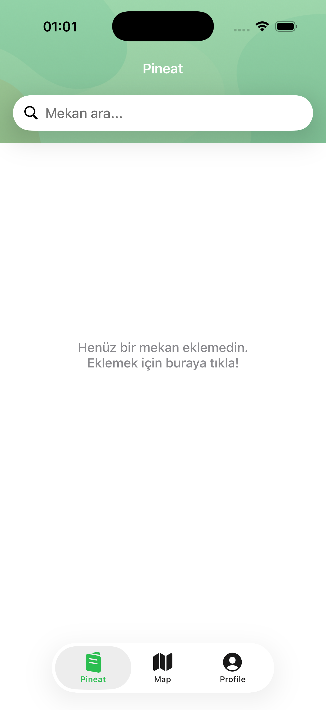
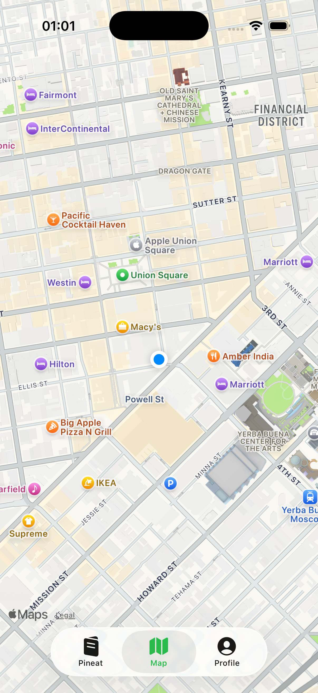

# Pineat 

Pineat is a UIKit-based iOS application that allows users to save, manage, and explore their personal places on a map.
Users can authenticate, add locations with notes and images, and view them both as a list and on a map.

This project focuses on clean UIKit architecture, async networking, and real-world backend integration.

---

## Screenshots

  
  
  
  

---

# Tech Stack
- UIKit
- Swift
- MVVM Architecture
- MapKit
- CoreLocation
- Supabase (Auth, Database, Storage)
- Kingfisher
- Swift Concurrency (async/await)
- Auto Layout

---

# Architecture Decisions - MVVM
The project follows the MVVM pattern to separate UI logic from business logic:
- ViewControllers handle only UI and user interaction
- ViewModels manage state, async operations, and data flow
- Models represent backend data structures

This improves maintainability and testability.

---

# Service Layer Abstraction
All backend interactions are abstracted using protocol-based service layers:
- AuthServiceProtocol
- LocationServiceProtocol
- ListServiceProtocol

---

API keys and sensitive credentials are **not included** in the repository.
